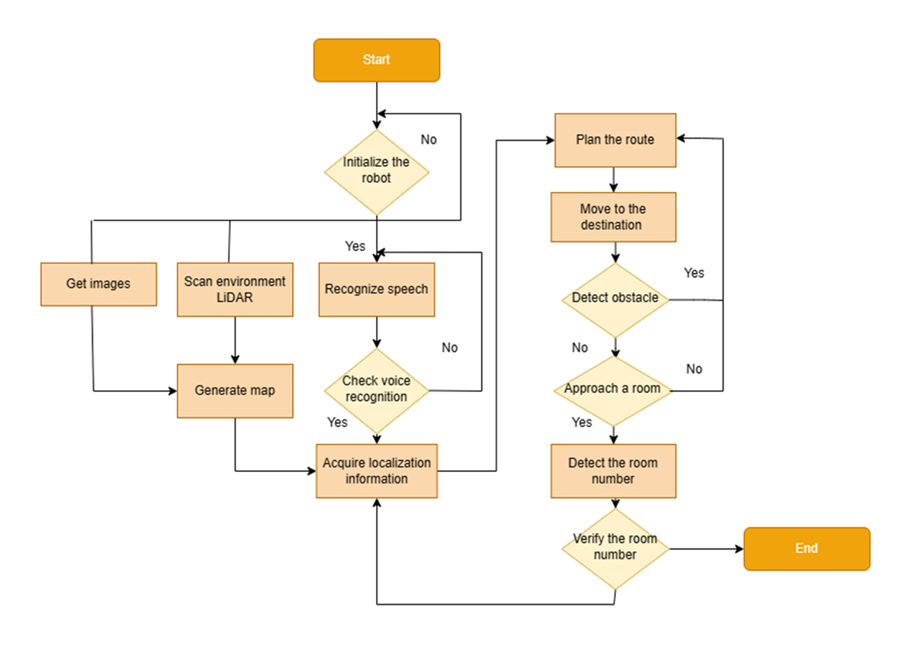

# Intelligent-Guide-Robot-Gazebo-Sim
Gazebo simulation of an intelligent guide robot in museum with audio interaction.

  

  

  

**Update on Jun 24th,2024:**

The project remained unfinished due to the constrained timeline of the course, which ran from the end of February to mid-May.

Drawing from my experience with ROS1, I managed to migrate the packages and build the system structure, fine-tuning parameters through experiments in the simulation environment.

I've observed that ROS’s reliance on each Ubuntu LTS version results in considerable repetitive effort for the community, especially when hardware integration is involved, posing more complex challenges than those encountered in data science tools.

Moreover, the mere tuning of algorithm parameters in open-source packages has become mundane for me. I hope to engage in tasks that utilize more innovative and interesting skills in the future.